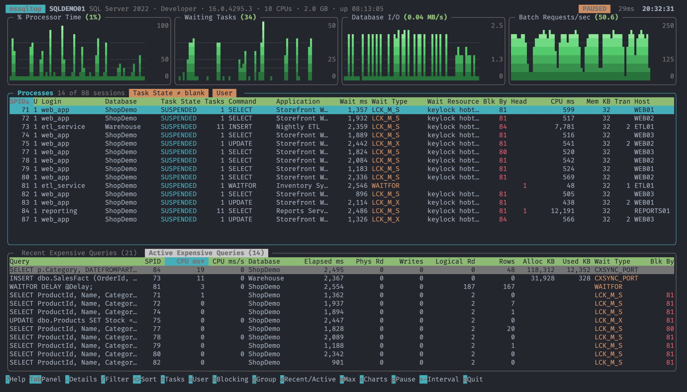

<div align="center">

# mssqltop

**`htop` for Microsoft SQL Server.** A full-screen terminal activity monitor modeled after the SSMS Activity Monitor.

[](https://www.npmjs.com/package/mssqltop)
[](https://www.npmjs.com/package/mssqltop)
[](https://nodejs.org)
[](LICENSE)
[](https://www.buymeacoffee.com/jlchmura)



</div>

---

You get the SSMS Activity Monitor without leaving the terminal: from your Mac, Linux box, SSH session, or tmux pane. No SSMS or Windows required.

```bash
npm install -g mssqltop
mssqltop -S my-sql-server
```

## Features

- 📈 **Live overview charts**: % Processor Time, Waiting Tasks, Database I/O, and Batch Requests/sec, drawn with block characters, or braille for twice the detail with `--graph braille`.
- 🧵 **Processes**: every session with task state, command, waits, blocking chains, and memory. It starts filtered to active user work.
- 🔥 **Recent Expensive Queries**: the costliest statements by CPU, reads, writes, and duration over a rolling window.
- ⚡ **Active Expensive Queries**: what's running right now, with CPU rate and memory grants.
- 🔎 **Drill-down**: press `Enter` on any row to see every column plus the full SQL text.
- 🔐 **Kerberos / Windows auth**: trusted connections work out of the box, and SQL logins are supported too.
- 🪶 **Low impact**: monitoring runs at `READ UNCOMMITTED`, with low deadlock priority and a lock timeout, so it never blocks your workload.

## Installation

mssqltop talks to SQL Server through the official Microsoft ODBC driver, so install that first:

| Platform | ODBC driver                                                                                                                                                  |
| -------- | ------------------------------------------------------------------------------------------------------------------------------------------------------------ |
| macOS    | `brew tap microsoft/mssql-release https://github.com/Microsoft/homebrew-mssql-release && brew install msodbcsql18`                                           |
| Linux    | [Install ODBC Driver 18 for SQL Server on Linux](https://learn.microsoft.com/sql/connect/odbc/linux-mac/installing-the-microsoft-odbc-driver-for-sql-server) |
| Windows  | [Download ODBC Driver 18 for SQL Server](https://learn.microsoft.com/sql/connect/odbc/download-odbc-driver-for-sql-server)                                   |

Then install mssqltop globally. It needs Node.js 22 or newer.

```bash
npm install -g mssqltop
```

## Usage

```bash
# Trusted connection (Kerberos on macOS/Linux, SSPI on Windows)
mssqltop -S sqlprod01.corp.example.com

# Non-default port or a named instance
mssqltop -S sqlprod01,14330
mssqltop -S 'sqlprod01\REPORTING'

# SQL login (or set MSSQLTOP_PASSWORD instead of passing -P)
mssqltop -S sqlprod01 -U monitor -P '…'

# Refresh every 5 seconds
mssqltop -S sqlprod01 -i 5
```

<details>
<summary><b>All options</b></summary>

```
Connection:
  -S, --server <host[,port]|host\instance>   SQL Server to monitor (or $MSSQLTOP_SERVER)
  -d, --database <name>        Initial database (default: master)
  -U, --user <login>           SQL login; omit to use a trusted (Kerberos) connection
  -P, --password <password>    Password for --user (or $MSSQLTOP_PASSWORD)
      --driver <name>          ODBC driver (default: "ODBC Driver 18 for SQL Server")
      --strict-certificate     Validate the server certificate (default: trust it)
      --connection-string <s>  Full ODBC connection string; overrides the options above

Refresh:
  -i, --interval <seconds>     Overview/process refresh interval (default: 2)
      --recent-interval <s>    Recent expensive queries poll interval (default: 10)
      --recent-window <s>      Window the recent expensive query rates cover (default: 60)

Display:
      --graph <block|braille>  Chart characters (default: block). braille has twice the vertical
                               detail if your terminal draws it well; see "Braille charts" below.

  -h, --help                   Show help
  -v, --version                Show the version
```

</details>

### Keyboard shortcuts

| Key                                             | Action                                                               |
| ----------------------------------------------- | -------------------------------------------------------------------- |
| `Tab`                                           | Switch between the Processes and Expensive Queries panels            |
| `↑` `↓` `PgUp` `PgDn` `Home` `End` (or `j` `k`) | Move the selection                                                   |
| `Enter`                                         | Details and full SQL text for the selected row                       |
| `e` or `←` `→`                                  | Toggle Recent / Active Expensive Queries                             |
| `/`                                             | Filter the focused panel by text (`Enter` keeps it, `Esc` clears it) |
| `<` `>`                                         | Change the sort column                                               |
| `i`                                             | Invert the sort order                                                |
| `t`                                             | Processes: only rows with a Task State                               |
| `u`                                             | Processes: only user processes                                       |
| `b`                                             | Processes: only blocked sessions and head blockers                   |
| `g`                                             | Processes: one row per session, or one row per task (SSMS style)     |
| `m`                                             | Maximize the focused panel                                           |
| `c`                                             | Show or hide the charts                                              |
| `p`                                             | Pause or resume refreshing                                           |
| `r`                                             | Refresh now                                                          |
| `+` `-`                                         | Lengthen or shorten the refresh interval                             |
| `?`                                             | Help                                                                 |
| `q`                                             | Quit                                                                 |

## Requirements

- **Permissions:** the login needs `VIEW SERVER STATE`.

  ```sql
  GRANT VIEW SERVER STATE TO [DOMAIN\monitoring-user];
  ```

- **SQL Server version:** tested against SQL Server 2016. It should work on 2012 and later, since it only uses DMVs available there.
- **Client OS:** developed and tested on macOS. Linux and Windows use the same ODBC driver and should work; reports are welcome. Prebuilt binaries for the `odbc` dependency cover macOS (arm64/x64), Linux x64, and Windows x64; other platforms (e.g. Linux or Windows on ARM64) compile it on install, which needs a C++ toolchain and, on Linux, the unixODBC headers (`unixodbc-dev`).
- **Terminal:** any modern terminal with Unicode and 256 colors (true color looks best). The optional braille charts also need a terminal that draws braille well; see [Braille charts](#troubleshooting).

## How it works

Each panel is computed from SQL Server's dynamic management views. Cumulative counters are sampled on each refresh and turned into rates.

| Metric                   | Source                                                                                                                          |
| ------------------------ | ------------------------------------------------------------------------------------------------------------------------------- |
| % Processor Time         | Δ(kernel + user time across `sys.dm_os_threads`) ÷ (elapsed × CPU count). This is SQL Server's own CPU, not the whole machine's |
| Waiting Tasks            | Rows in `sys.dm_os_waiting_tasks` that belong to user sessions                                                                  |
| Database I/O             | Δ(bytes read + written) across `sys.dm_io_virtual_file_stats`                                                                   |
| Batch Requests/sec       | Δ of the `Batch Requests/sec` performance counter                                                                               |
| Processes                | `sys.dm_exec_sessions` ⟕ `requests` ⟕ `dm_os_tasks` ⟕ `dm_os_waiting_tasks`, like SSMS                                          |
| Recent Expensive Queries | Δ of `sys.dm_exec_query_stats` totals per `query_hash`, summed over a rolling 60s window                                        |
| Active Expensive Queries | `sys.dm_exec_requests` ⟕ `sys.dm_exec_query_memory_grants`                                                                      |

mssqltop opens two connections: one for the fast refresh, and one for the heavier plan-cache scan so it never stalls the charts. Its own sessions and statements are hidden from the lists.

## Troubleshooting

<details>
<summary><b>Braille charts (<code>--graph braille</code>): rings around the dots, bars two dots wide, blinking, or gaps</b></summary>

By default the charts use block characters (2×2 per character), which look the same in virtually every terminal. `--graph braille` draws them like btop instead: each character is a 2×4 grid of dots, and each sample is one dot column, so you get twice the vertical detail and spikes a single dot wide. How good that looks depends entirely on how your terminal draws braille:

- **Rings around the dots:** some fonts draw the _unused_ dot positions as faint rings. Every bar then looks two dots wide, and the charts seem to blink as they scroll. For example, none of Hyper's default fonts contain braille, so on macOS it falls back to the Apple Braille font, which draws rings.
- **Gaps between rows:** if the braille font's characters are shorter than your main font's line height, every fourth dot has a larger gap above it.

Terminals that draw braille themselves, like VS Code's, have neither problem. To check yours, run this. If `⡇` shows a full 2×4 grid instead of one column of dots, your terminal draws rings:

```bash
printf '⡇⡇⡇  ⢸⢸⢸  ⣿⣿⣿\n'
```

To fix the rings, configure your terminal to draw braille with a font that shows only the lit dots, keeping your main font for everything else. On macOS, **Apple Symbols** is such a font (avoid the "Apple Braille Outline" and "Pinpoint" faces, which draw the rings). In Hyper, add it to `fontFamily` in `~/.hyper.js` right after your main font:

```js
fontFamily: '"Fira Code", "Apple Symbols", Menlo, monospace',
```

Other terminals can assign a separate font to a character range too: iTerm2's "Use a different font for non-ASCII text", Kitty's `symbol_map U+2800-U+28FF`, and Ghostty's `font-codepoint-map`. If braille still doesn't look right, stick with the default block charts.

</details>

<details>
<summary><b>Login failed / "Cannot generate SSPI context" on macOS or Linux</b></summary>

Trusted connections use your Kerberos ticket. Check that you have one and that it's for the right realm:

```bash
klist                          # show current tickets
kinit you@CORP.EXAMPLE.COM     # get a ticket if you don't have one
```

Connect using the server's fully qualified domain name, so the driver can find its SPN (`MSSQLSvc/host.corp.example.com:1433`).

</details>

<details>
<summary><b>"Data source name not found" or "Can't open lib"</b></summary>

The ODBC driver isn't installed, or it's a different version. List the installed drivers and pass the right name with `--driver`:

```bash
odbcinst -q -d
mssqltop -S myserver --driver "ODBC Driver 17 for SQL Server"
```

</details>

<details>
<summary><b>"Login timeout expired"</b></summary>

The server isn't reachable on its SQL port within 15 seconds. Check the host name, the port (`-S host,port`), and any firewalls or VPN.

</details>

## Try it without a server

The repo includes a Docker-based SQL Server with a realistic simulated workload. See [demo/README.md](demo/README.md).

## Contributing

Issues and pull requests are welcome! [CONTRIBUTING.md](CONTRIBUTING.md) covers setup, the project layout, how to run the tests (no database needed), and the SQL Server gotchas to know before changing a query.

## Support

If mssqltop saves you a trip to SSMS, you could buy me a coffee ☕

<a href="https://www.buymeacoffee.com/jlchmura"></a>

## License

[MIT](LICENSE) © John Chmura

<sub>Not affiliated with or endorsed by Microsoft. SQL Server and SQL Server Management Studio are trademarks of Microsoft Corporation.</sub>
